In this document we instruct how to register all needed accounts and how to fill in the token_key_session.py from these account info. Configuring all these accounts is a one-time effort, and will take around 30 minutes. 


### Part1 Overview
In part 1, we will introduce all accounts needed in launching full evaluation of Toolathlon.

#### Remote Ones
- google account x 1
    - to generate credentials
    - to generate api key
    - to generate service account
- github account x 1
    - to generate github tokens
- wandb account x 1
    - to generate wandb token
- notion account x 1
    - to generate connection secrets
- snowflake account x 1
    - to collect account, warehouse, etc
- huggingface account x 1
    - to generate Huggingface token

#### Local Ones
All local accounts will be already automatically created after you ran `bash global_preparation/deploy_containers.sh` following the main README.md.
see `configs/users_data.json` for all accounts we will create

We by default register all the accounts in `config/users_data.json` to Canvas and Poste, and we will register the #81 to #100 accounts to woocommerce and create a subsite for each of them.

### Part2 Register Remote Accounts and Configurate Them

#### Google Account
1. We recommand register a new account for it
2. Launch a Google Cloud Project under this account
    - https://console.cloud.google.com/
    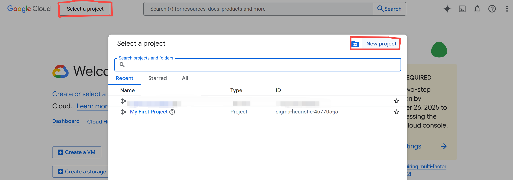
    - Say we name it as "TestProject"
    - After creating, click the `Select a Project` button again (it may become the of another project, but click that button anyway) and then select the "TestProject"
    - Please fill the project ID to the `gcp_project_id` variable in `configs/token_key_session.py`
    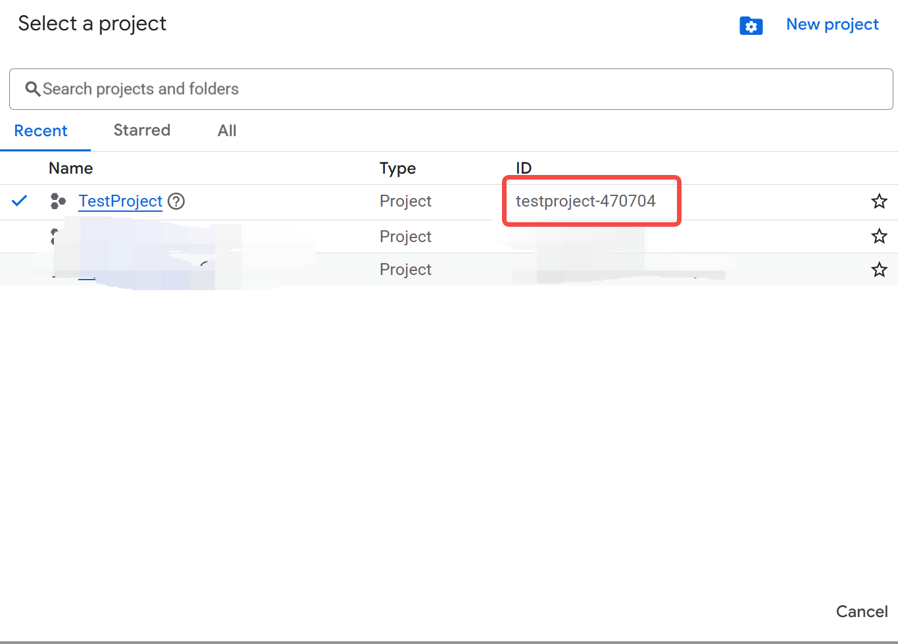
3. Enable all needed APIs

    Make sure you have `gcloud` sdk installed, e.g.:

    ```
    curl -O https://dl.google.com/dl/cloudsdk/channels/rapid/downloads/google-cloud-sdk-456.0.0-linux-x86_64.tar.gz
    tar -xf google-cloud-sdk-*-x86_64.tar.gz
    ./google-cloud-sdk/install.sh
    source ~/.bashrc # or ~/.zshrc
    ```

    Then just run 
    ```
    bash global_preparation/batch_enable_gloud_apis.sh {gcp_project_id}
    ```

    <details>
    <summary>(Or if you do not want to use gcloud cli ...) Legacy GUI-based Operations</summary>
    - Upon switch to that project, go to `APIs and services` from the side bar

    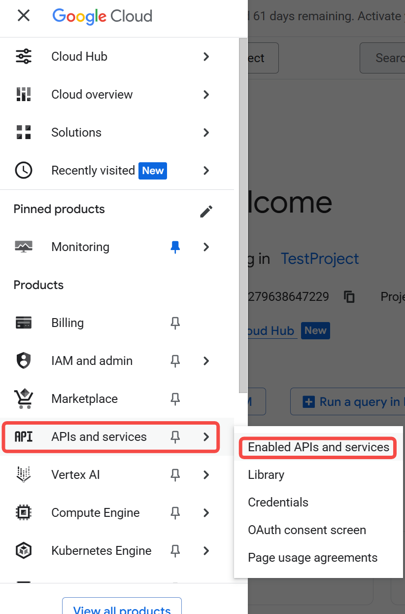
    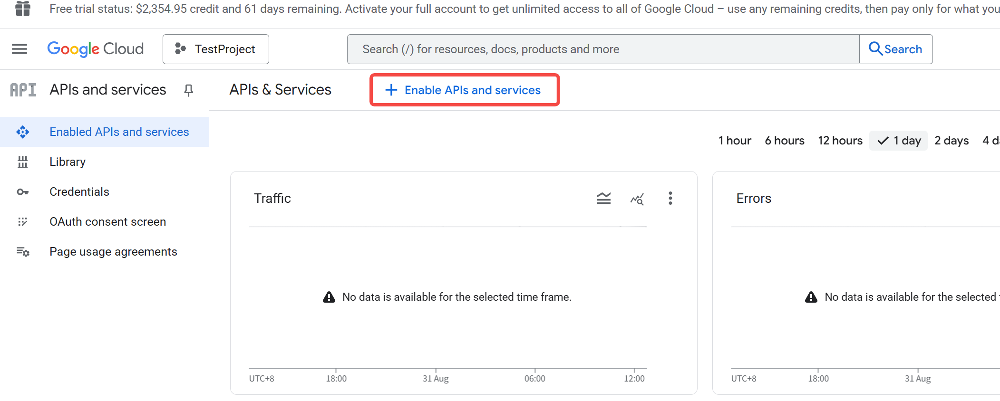
    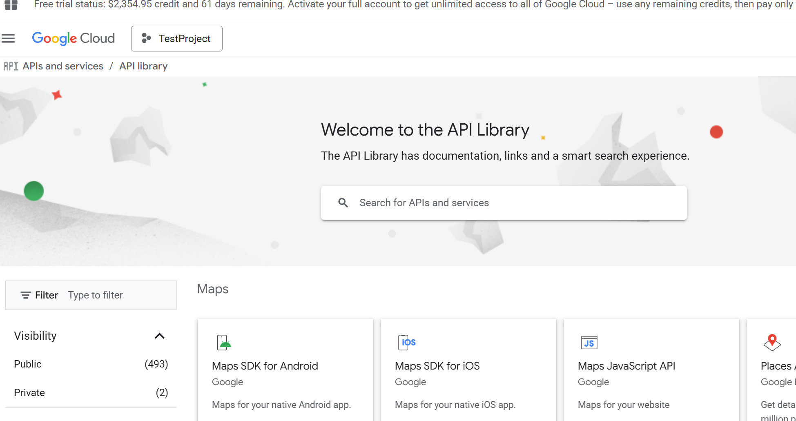

    - Take `Youtube Data API v3` as an example
    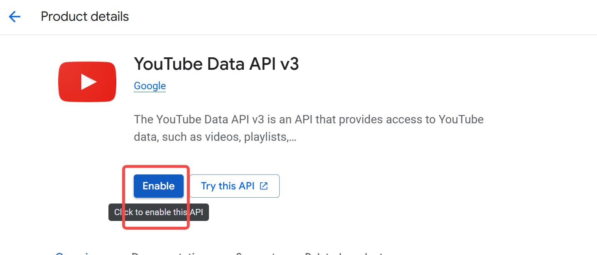

    - Enable all needed API services in the following list
        ```
        YouTube Data API v3
        Gmail API
        Google Sheets API
        Google Calendar API
        Google Drive API
        Google Forms API
        Analytics Hub API					
        BigQuery API					
        BigQuery Connection API					
        BigQuery Data Policy API					
        BigQuery Migration API					
        BigQuery Reservation API					
        BigQuery Storage API					
        Cloud Dataplex API					
        Cloud Datastore API					
        Cloud Logging API					
        Cloud Monitoring API					
        Cloud OS Login API					
        Cloud SQL					
        Cloud Storage					
        Cloud Storage API					
        Cloud Trace API					
        Compute Engine API					
        Custom Search API					
        Dataform API					
        Directions API					
        Distance Matrix API					
        Drive Activity API					
        Google Cloud APIs					
        Google Cloud Storage JSON API					
        Google Docs API					
        Google Slides API					
        Maps Grounding API					
        Places API					
        Privileged Access Manager API					
        Routes API					
        Service Management API					
        Service Usage API
        ```
    </details>
4. Oauth2.0 Authentication
    - Go to "APIs & Services" > "Credentials"
    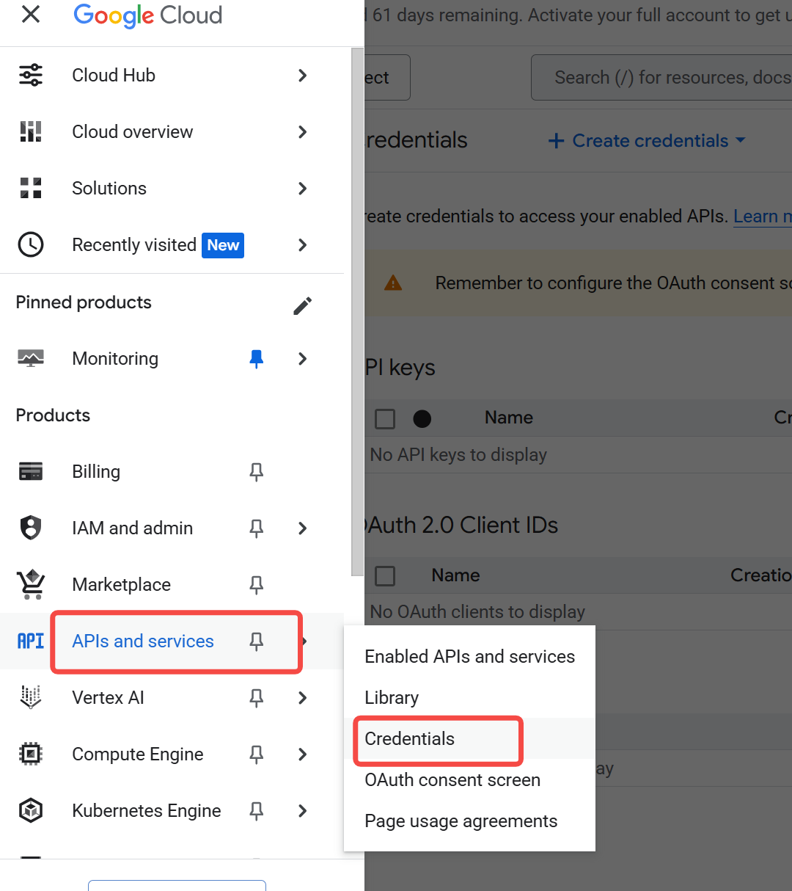
    - Click "Create Credentials" > "OAuth client ID"
    
    *Note: you may see these pages, just fill in the cells and go ahead.
    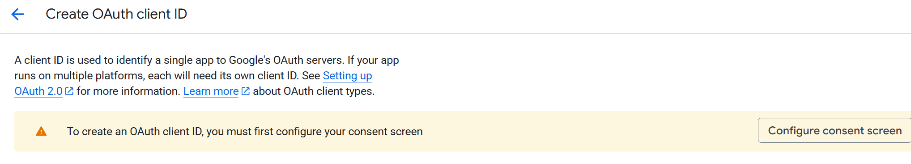
    

    - Choose "Web application" as application type, give it a name and click "Create". For Web application, add http://localhost:3000/oauth2callback to the authorized redirect URIs
    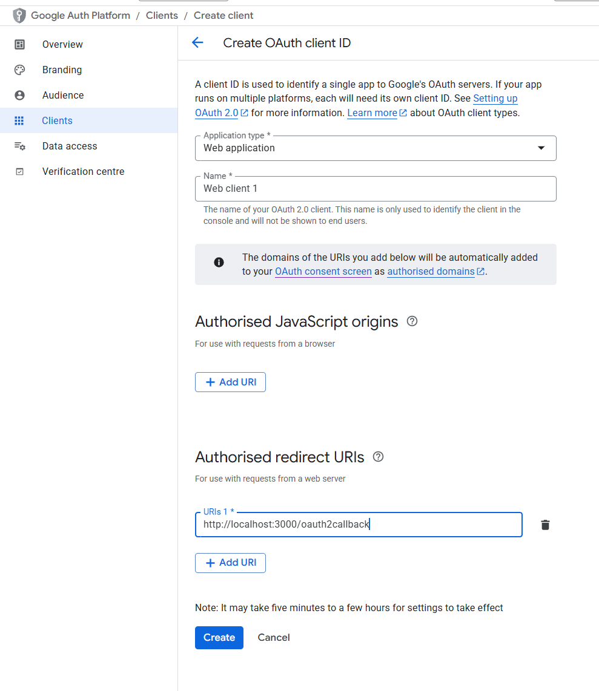
    - Download the JSON file of your client's OAuth keys
    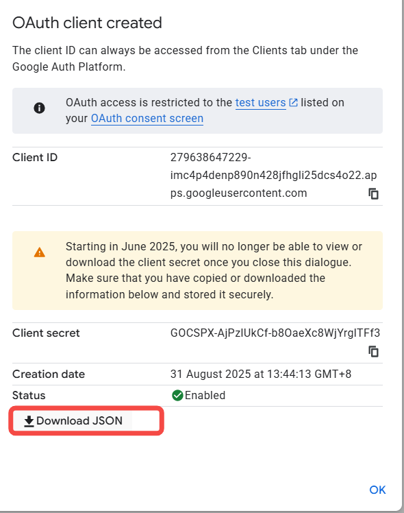
    - Rename this key json file to `gcp-oauth.keys.json` and place it under `configs`
5. Switching Publishing Status
    - Visit this https://console.cloud.google.com/auth/audience (or "APIs and servises" -> "OAuth consent screen" -> "Audience") and publish the app
    
    We do this to make sure the refresh token generated in Step 6 will not expire shortly (7 days in testing status)

    - (Alternative if you do not want to publish) If you do want to keep it in testing status, you can add your google account as a test user
    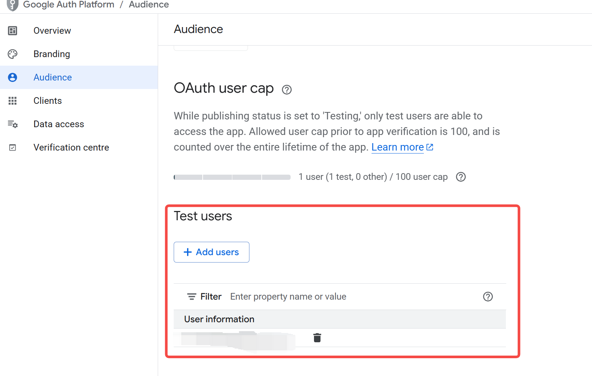 You can also add other accounts as well if you want.
    **WARNING**: In this case, you may need to regenerate the credentials in step 6 every week, which is annoying.

6. Generate credentials
    - Make sure you are under the root directory of this project and then
        ```
        uv run global_preparation/create_google_credentials.py
        ```
    - Follow the prompts to proceed. If the PC browser doesn't redirect, you can copy the link address to your mobile device to obtain the required content.

    - It will automatically generate `configs/google_credentials.json` based on the `configs/gcp-oauth.keys.json` file mentioned in step 4.
7. Get API key
    - Go to "APIs & Services" > "Credentials" again
    - Select "API key" after click "+Create credentials", and create a new one
    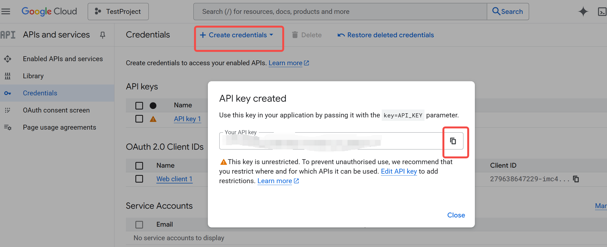
    - Paste this api key to the `google_cloud_console_api_key` variable in `configs/token_key_session.py`    
8. Create a service account
    - Go to "APIs & Services" > "Credentials" again
    - Select "Service account" after click "+Create credentials", and create a new one. Please select `Role` as `Owner`
    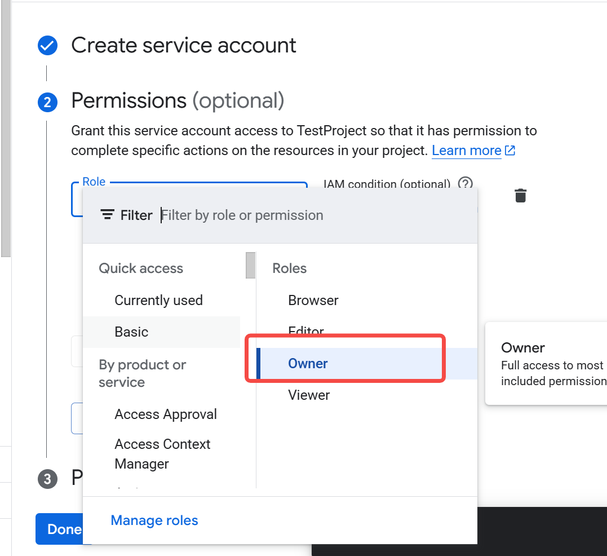
    - Once this service account is created, we get a key json file for it, first click the service account you just created
    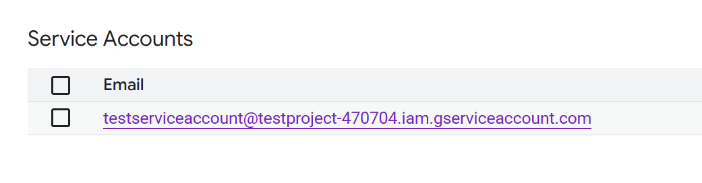
    Go to the `Keys` session and click `Add key`
    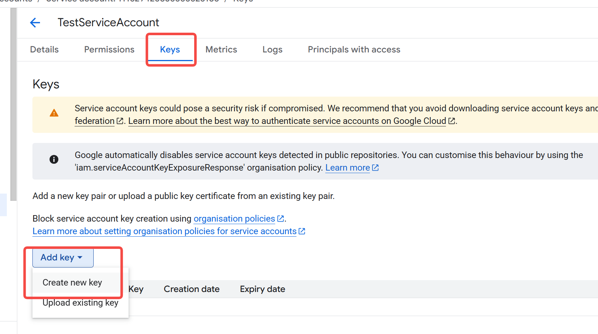
    Choose `JSON`
    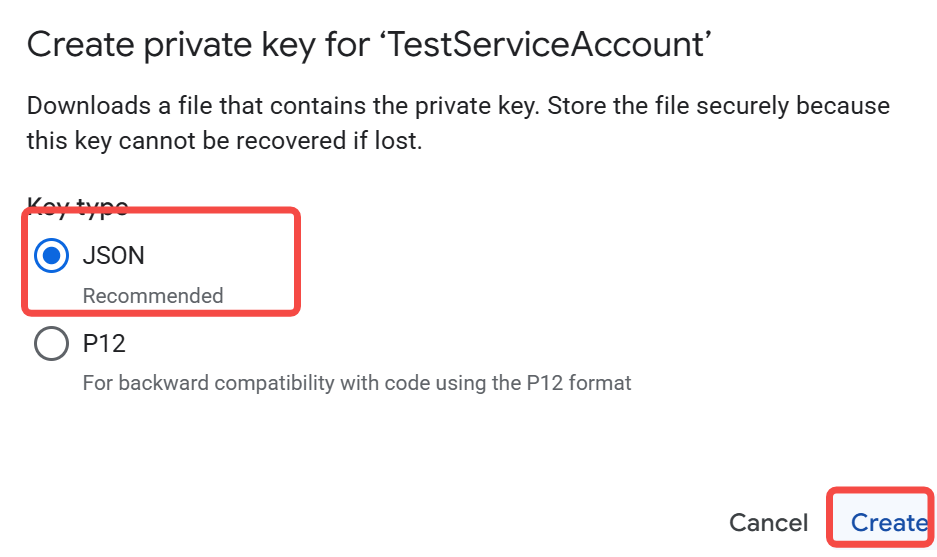
    Then rename and move the downloaded key json file to `configs/gcp-service_account.keys.json`

#### Github Account
We recommand register a new github account, and generate a full premission read-write token for this account (see https://docs.github.com/en/authentication/keeping-your-account-and-data-secure/managing-your-personal-access-tokens or directly https://github.com/settings/tokens/new).
Paste the read-write token to the `github_token` variable in `configs/token_key_session.py`
*Make sure your key has premissions to all operations, including delete repositories.

#### Huggingface Account
We recommand register a new huggingface account, and generate a read-write token for this account (see https://huggingface.co/docs/hub/security-tokens or directly https://huggingface.co/settings/tokens/new?tokenType=write).
Paste the read-write token to the `huggingface_token` variable in `configs/token_key_session.py`

#### WandB Account
We recommand register a new WandB account, and get your API Key for this account (see https://wandb.ai/authorize).
Paste the read-write token to the `wandb_api_key` variable in `configs/token_key_session.py`

#### Notion Account
*This part is largely taken from [MCPMark](https://github.com/eval-sys/mcpmark/blob/main/docs/mcp/notion.md)

We recommand register a new notion account and create a new workspace.

First run `uv run -m global_preparation.special_setup_notion_official` to connect the workspace in the above step to the official online notion mcp. This facilates us to duplicate and move pages more efficiently!

<details>

<summary>If you indeed want to do notion preprocessing via playwright ... (NOT RECOMMANDED!)</summary>

First run `uv run utils/app_specific/notion/notion_login_helper.py --headless` to generate a `notion_state.json` under the `configs`, please just follow the instructions from the script, this is a one-time effort.

You also need to change the variable `notion_preprocess_with_playwright` to `True` in `configs/global_configs.py`

</details>
--


Please duplicate the public page [Notion Source Page](https://amazing-wave-b38.notion.site/Notion-Source-Page-27ad10a48436805b9179fdaff2f65be2) to your workspace,
record the url of this duplicated page (not our public page) as the `source_notion_page_url` variable in `configs/token_key_session.py`

Please also create a new page called `Notion Eval Page` directly under your workspace,
record the url if this new page as the `eval_notion_page_url` variable in `configs/token_key_session.py`

Also, create an intrgration that include these above two pages, see https://www.notion.so/profile/integrations, and record the "Internal Integration Secret" as `notion_integration_key` veriable in `configs/token_key_session.py`
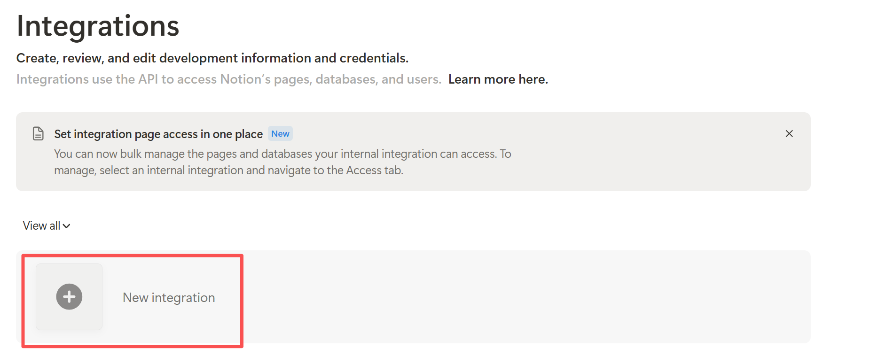
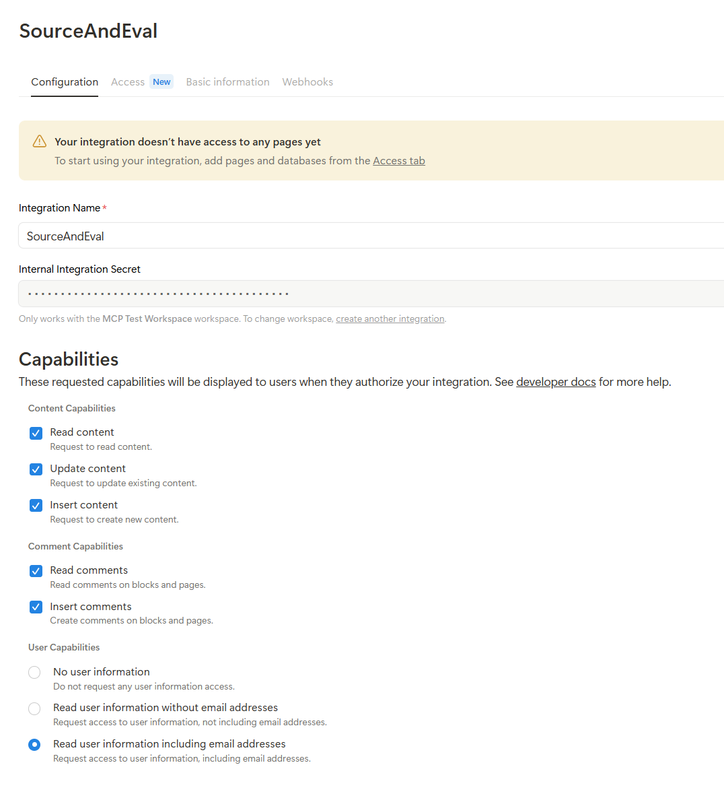
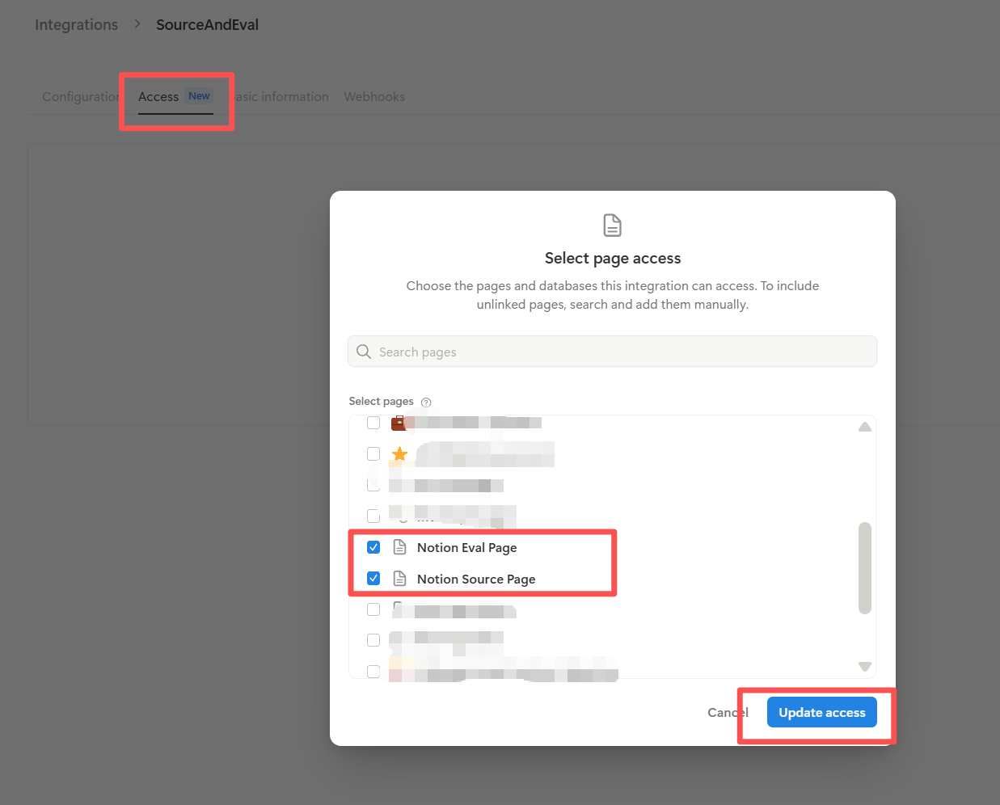

Finally, similar to the above steps, create an intrgration key for evaluation use only. Please only select `Notion Eval Page` into the access range of it. Record this key as `notion_integration_key_eval` variable in `configs/token_key_session.py`.


#### SnowFlake Account
We recommand register a new Snowflake account (see https://signup.snowflake.com/). After you have created and activated the account. Find your account details and fill them into the `snowflake_account`, `snowflake_role`, `snowflake_user` and `snowflake_password` variables in `configs/token_key_session.py`
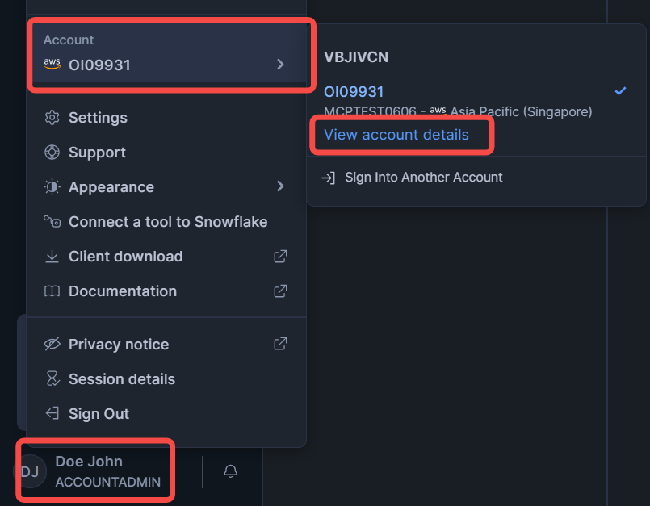
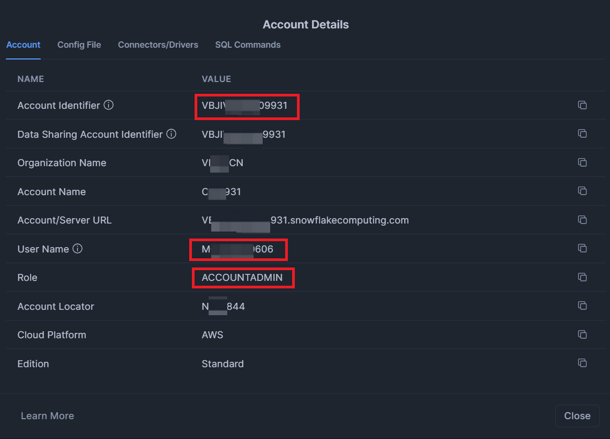

#### Serper Account
We use Serper.dev in our local web search tool. Please register your account on https://serper.dev and get your key from https://serper.dev/api-keys. Then fill it into the `serper_api_key` variable in `configs/token_key_session.py`.